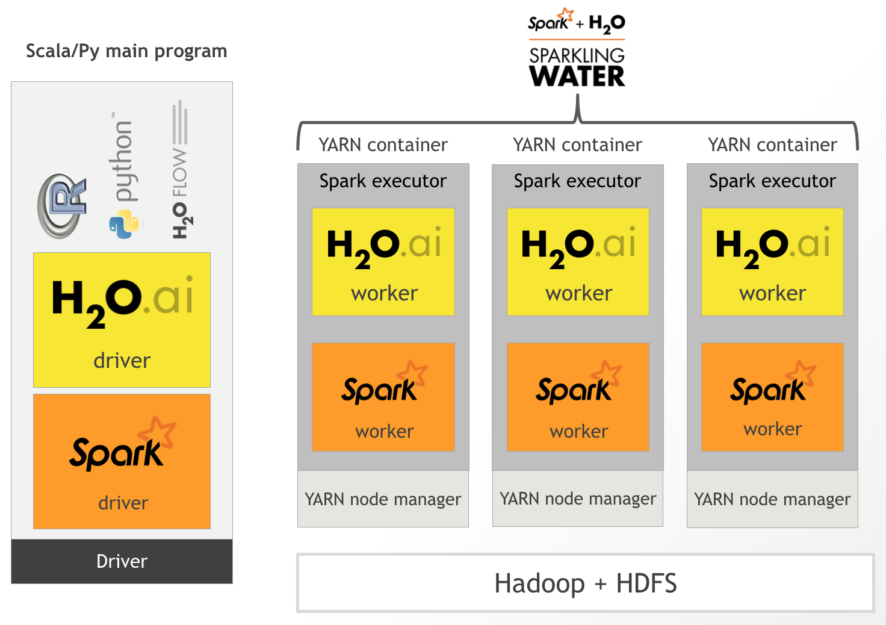
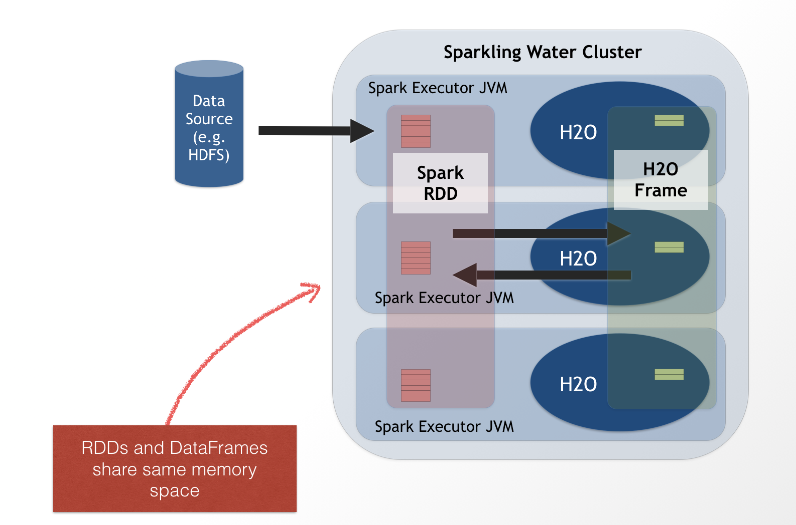
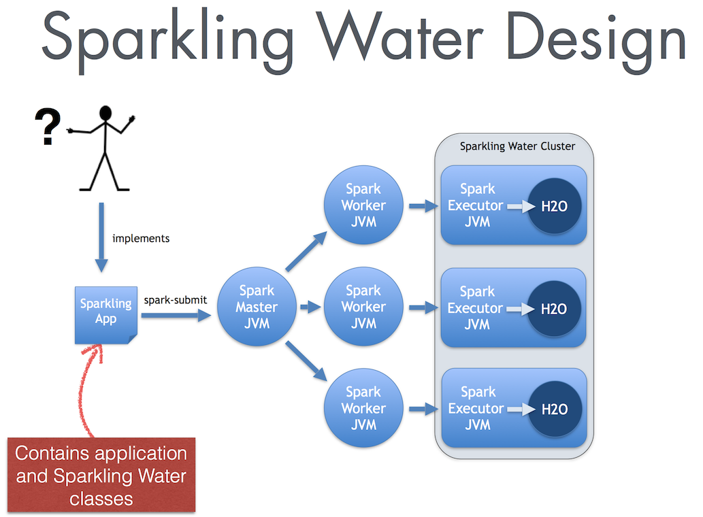

# QCon 2105 - Building Machine Learning Applications with Sparkling Water

## Introduction to Sparkling Water

- [Installation of Spark](#installation_of_spark)
- [Running Spark shell](#running_spark_shell)
- [Installation of Sparkling Water](#installation_of_sparkling)
- [Basic architecture](#basic_architecture)
- [Hands on demonstration of Sparkling Water](#hands_on)
- [Running Sparkling Shell](#run_it_yourself)

## Requirements
 
 - [Oracle Java 7+](http://www.oracle.com/technetwork/java/javase/downloads/jdk7-downloads-1880260.html) 
 - [Spark 1.5.1](http://spark.apache.org/downloads.html) 
 - [Sparkling Water 1.5.6](http://h2o-release.s3.amazonaws.com/sparkling-water/rel-1.5/6/index.html)
 - [Datasets](https://raw.githubusercontent.com/h2oai/sparkling-water/master/examples/smalldata/smsData.txt) 

## Installation of Spark

To install Spark simply uncompress the tar file in the install folder and set your SPARK_HOME to the unzipped directory.

```
tar -xvf spark-1.5.2-bin-hadoop2.6.tgz
cd spark-1.5.2-bin-hadoop2.6
export SPARK_HOME=`pwd`
```
Note: For your convenience you can set your SPARK_HOME environmental variable in your bashrc file to avoid having to set the variable when opening new terminal sessions.

## Running Spark Shell

The Spark shell comes with your installation with Spark and is a great way to learn the API. The interactive interface provides instant feedback to the users' code. You will need to write Scala code in the Spark shell but because it runs on a Java VM you will be able to use existing Java libraries or attach jar files to your Spark environment. 


### Turn off info logging (optional)

By default the Spark shell will report all log information to the console when you input and execute code. In order to avoid a smathering of logging of output you can edit your log4j in the configuration directory:

```
cd $SPARK_HOME/conf
vi log4j.properties.template
```
and change the parameter `log4j.rootCategory=INFO, console` to `log4j.rootCategory=WARN, console` and only the warning messages will be reported to the Spark console.

### Start Spark Shell

To start the Spark shell run the following in the Spark directory:

```
cd $SPARK_HOME
bin/spark-shell
```

### Read in data

To read in data into Spark, you can either read files in text format or import files as data frames. 

```
//Import SMS data
val smsData = sc.textFile("../../data/smsData.txt")
```

### Exercise

The data smsData is now a RDD which means you can take *actions* on the RDD or *transform* the RDD. We will take a look at a few actions you can take on the RDD. In the console when you hit tab on ```smsData.``` you will get a list of all possible actions you can take on a RDD.

First let's try counting the number of line items in the dataset:

```
//Count the number of line items in the data
smsData.count()
```
You should get **1324** lines of data, if you didn't please make sure you imported the right dataset. If you fail at `smsData.count()` it is likely your path is not right, please keep in mind all paths are relative to your `SPARK_HOME`.

Next please try to `take` the first 5 lines of the data which will print the lines of data to the console for viewing:

```
//View the first few line of the files with action take
smsData.take(5)
```

Next, let's try to find out how many entries in the dataset are nonspam text messages.

1. Transform the data by filtering out only the line items that are not considered to be spam aka labeled as ham using `filter`.
2. Assign the filtered dataset to hamData.
3. Count the number of line items in new RDD hamData.

```
val hamData = smsData.filter(line => line.contains("ham")) 
hamData.count
```
Did you get **1014**?

## Installation of Sparkling Water

To install Sparkling Water simply unzip the zipped file in the install folder and set your SPARKLING_HOME to the unzipped directory.

```
unzip sparkling-water-1.5.6.zip
cd sparkling-water-1.5.6
export SPARKLING_HOME=`pwd`
```
Note: For your convenience you can set your SPARKLING_HOME environmental variable in your bashrc file to avoid having to set the variable when opening new terminal sessions.

## Basic Architecture

The integration of H2O with Spark's ecosystem provides environment for the user to use H2O data structures and algorithms with Spark's API. The result is a platform for building smarter applications. Similarly to launching a Spark cluster, launching a Sparkling Water cluster essentially requires starting a driver instance that launches the specified number of worker nodes and the worker nodes will launch the Spark executor JVMs with H2O.
	


Spark RDD or DataFrames and H2O Frames share the same memory space and can be transformed from one to the other.

When converting a H2OFrame to a RDD, a wrapper is created around the H2OFrame to provide an RDD-like API. In this case, no data is duplicated; instead, the data is served directly from then underlying H2OFrame.

Converting in the opposite direction (from RDD to H2OFrame) introduces data duplication, since it transfers data from RDD storage into H2OFrame. However, data stored in H2OFrame is heavily compressed.




## Hands On Demo of Sparkling Water

Your installation of Sparkling Water comes preloaded with a few Sparkling Water workflows and we can examine the code more cloesly but let's start by submitting one of these jobs to Spark just to run through an example.

We will run the self contained Ham or Spam Application which is essentially a spam detector for text messages. The application will read in data build a model to detect whether the texts is ham (not spam) or spam and score two new inputs. To run the application execute in your SPARKLING_HOME:

```
cd $SPARKLING_HOME
bin/run-example.sh HamOrSpamDemo
```

When executing the run-example.sh script you are doing a spark-submit that will launch the Spark Master JVM which launches the default three Spark Worker JVMs and finally the subsequent Sparkling Water cluster where the HamOrSpamDemo.scala script is ran.



The final output from the app should be a text that looks like a text from a friend which is labeled as not spam and then a text that looks like is from a telemarketer which is marked as spam:

```
"Michal, beer tonight in MV?" is HAM
       
"We tried to contact you re your reply to our offer of a Video Handset? 750 anytime any networks mins? UNLIMITED TEXT?" is SPAM
```


## Running Sparkling Shell

Sparkling shell is essentially running `spark-shell` with the added H2O jar file. Sparkling shell will give you all the interactive scripting capabilities of spark shell with the addition of being able to create a H2OContext and launch a H2O instance in the Spark executor JVM.

```
$SPARK_HOME/bin/spark-shell --jars $TOPDIR/assembly/build/libs/$FAT_JAR --driver-class-path $TOPDIR/assembly/build/libs/$FAT_JAR --driver-memory $DRIVER_MEMORY --conf spark.driver.extraJavaOptions="-XX:MaxPermSize=384m" "$@"
```

### Start Sparkling Shell

To start the Sparkling shell run the following in the Sparkling Water directory:

```
cd $SPARKLING_HOME
bin/sparkling-shell
```

### Start H2O and Import H2OContext

```
import org.apache.spark.h2o._
val h2oContext = new H2OContext(sc).start() 
import h2oContext._ 
```
To open the launched the H2O Web UI or Flow:

```
openFlow
```


### Read in data

To read in data into Spark, you can either read files in text format or import files as data frames. 

```
//Import SMS data
val smsData = sc.textFile("../../data/smsData.txt")
```

### Exercise 
